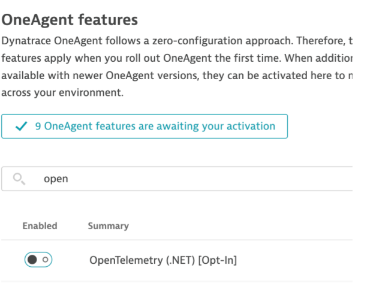
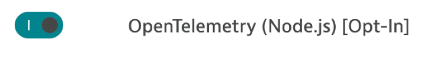
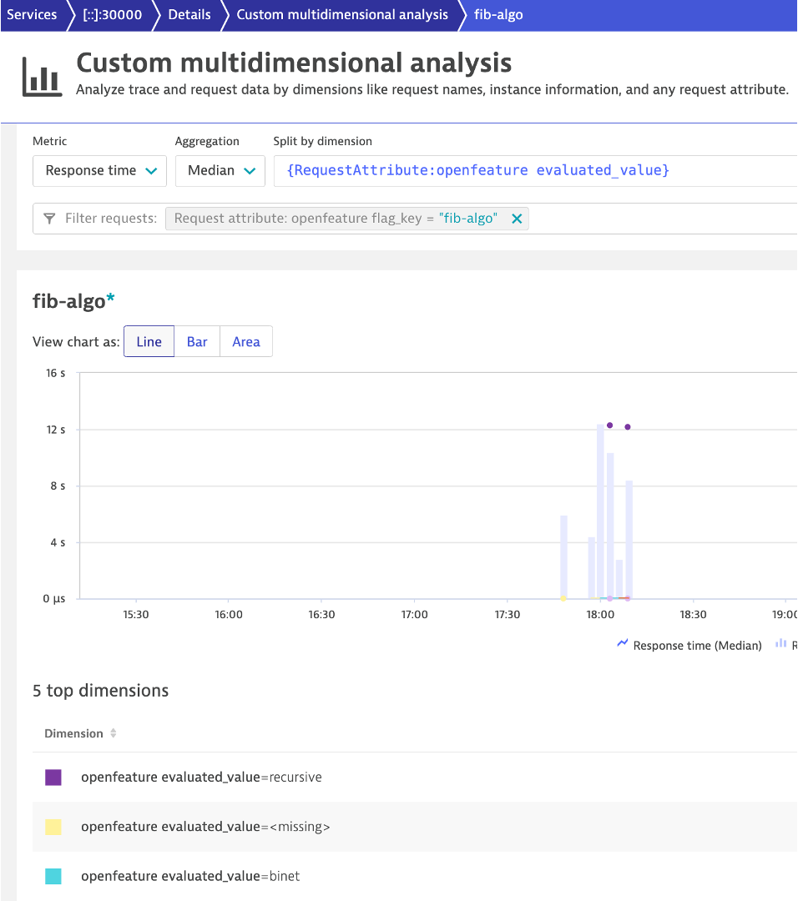
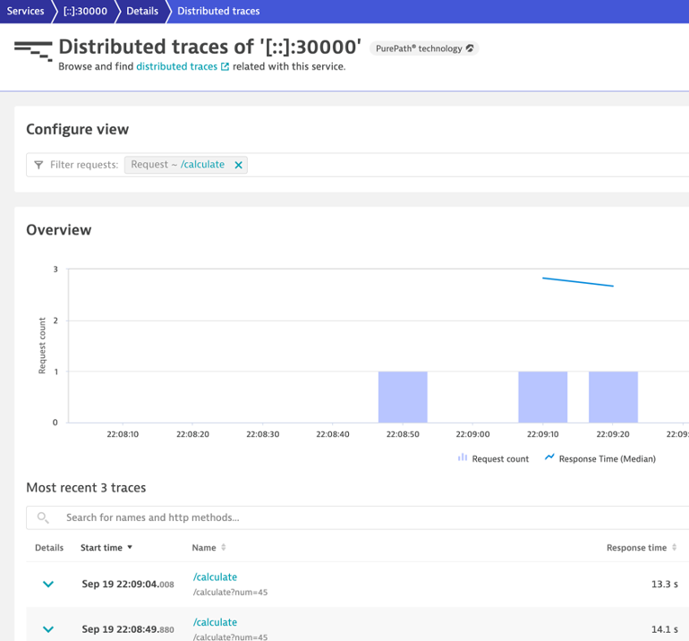
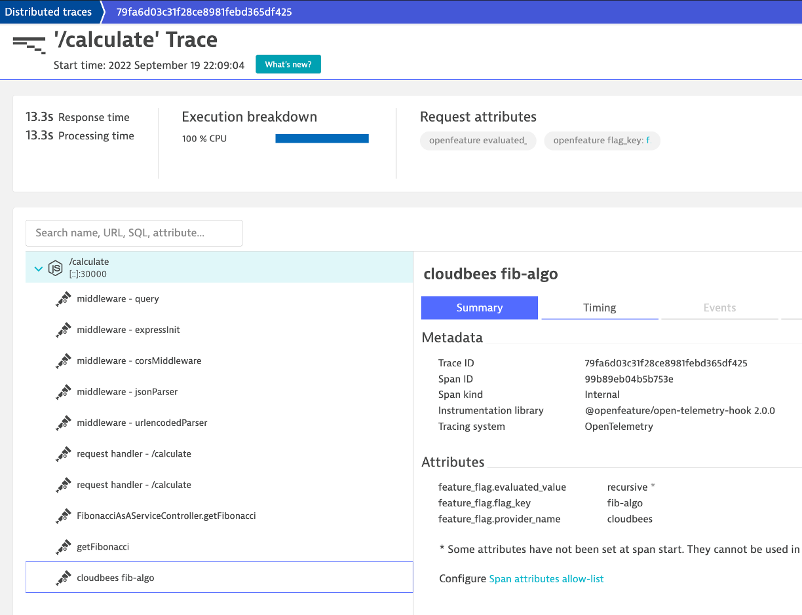

# Overview

[Dynatrace](http://dynatrace.com) is one option to view the OpenTelemetry distributed trace attribute spans created by OpenFeature.

This guide describes how to deploy the playground application on virtual machine using `docker-compose` withing monitoring by the [Dynatrace OneAgent](https://www.dynatrace.com/hub/detail/oneagent/).

# Prerequisites 

1. Dynatrace tenant - if you don't have one one sign up for a [free SaaS trial](http://dynatrace.com/trial)
1. A virtual machine with the following:
    * Docker and Docker Compose installed
    * [Dynatrace OneAgent](https://www.dynatrace.com/support/help/setup-and-configuration/dynatrace-oneagent) installed
    * Port 5000 is publicly available.  If you want to use another port you will need to adjust the `docker-compose.yaml` described below
1. The provider specific keys have been created along with the provider flags are setup per the [README](README.md) file

# Configure Dynatrace OneAgent Features

1. In your Dynatrace tenant, navigate to `Settings -> Preferences -> OneAgent Features`
1. Add filter to `open` and you should see the `OpenTelemetry` switches

    

1. Enable the `OpenTelemetry (Node.js)` switch to opt-in

    

# Add Dynatrace request attributes

Repeat these steps three times where the only difference is the `request attribute name` and the `Attribute key` as described below. A completed attribute should look as follows:

1. In your Dynatrace tenant, navigate to `Settings -> Server-side service monitoring -> Request attributes`
1. Set the `request attribute name` 
    * First request attribute --> openfeature flag_key 
    * Second request attribute --> openfeature evaluated_value
    * Third request attribute --> openfeature provider_name
1. Add a new request attribute and provide name
1. Check the `Allow the request attribute to access unmasked personal data`
1. Choose rule applies to `Node.js` technology
1. Choose `Span attribute` as the `request attribute source`
1. Set in the `Attribute key`
    * First request attribute --> feature_flag.flag_key 
    * Second request attribute --> feature_flag.evaluated_value
    * Third request attribute --> feature_flag.provider_name

# Start up playground application

1. Copy the [docker-compose.template](docker-compose.template) file to the virtual machine
1. Rename the `docker-compose.template` file to `docker-compose.yaml`
1. Edit the `docker-compose.yaml` file with the provider specific environment values per the [README](README.md) file
1. Run the `docker-compose up -d` command to start the playground application
1. Verify access to to the application in a browser.  For example `http://[VM IP]:5000`

# View trace within Dynatrace

Once you have send requests to the playground application, you can use view each distributed trace in Dynatrace and observe the OpenFeature spans values.

1. In your Dynatrace tenant, navigate to `Services` list and open the playground service
1. Choose the `View Distributes Traces` button
1. Filter on requests with value `/calculate` as shown below

    

1. On a trace row, open the `Actions` and choose the `trace` menu option
1. On the trace detail page, click on the the provider fib-algo span to view the attributes as shown in the CloudBees example

    

# Analyze trace within Dynatrace

Once you have send requests to the playground application, you can use the [Dynatrace Multidimensional analysis](https://www.dynatrace.com/support/help/how-to-use-dynatrace/diagnostics/multidimensional-analysis) to analyze the volume or response times across the different traces.

1. In your Dynatrace tenant, navigate to `Services` list and open the playground service
1. Choose the `Create analysis view` button 
1. In the `Dynatrace Multidimensional view`, choose the `{RequestAttribute:evaluated_value}` in the `Split bu Dimension` header
1. In the `filter requests` section, choose `openfeature flag_key` and enter the value `fib-algo`

 A completed view should look as follows:

